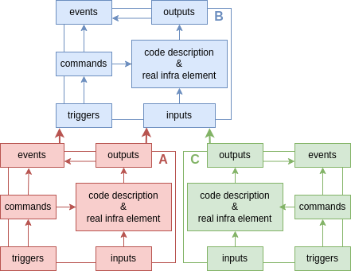
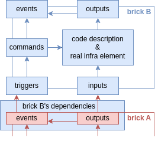

# Brick Concept and Dependencies

This documentation will help you understand how to represent a brick and its 
sub-elements and how manipulating these elements will enable us to manage the 
three types of dependencies.

To grasp the rationale behind this concept, you should read this article: 
[philosophy](./philosophy.md).

## Defining the Brick Concept

### In Brief

Firstly, exeIaC deals with infra bricks. What is an infra brick? Essentially, 
it's a directory containing infrastructure code. This could be a terraform 
directory for deploying a VM, an ansible playbook for configuring a host, a 
helm chart, or simply a template describing manual instructions.

### Delving Deeper

In order to manage our infrastructure in a simple way, exeIaC solely focuses on 
one concept : the brick. Therefore, an infra can be seen as one super brick 
containing bricks, which in turn can contain more bricks and so on. 

Bricks are layed on other bricks and thus depend on previously laid bricks. 
Where are these dependencies? Since we only have one concept, these dependencies
are also within bricks.

From a DevOps perspective, we aim for a comprehensive approach to infra. Thus, 
infrastructure should contain all elements and process to deploy and maintain an
application on line. Therefore, a brick encompasses not only the Terraform code 
but also includes the Makefile for deployment (and not just deployment but also 
planning, linting, etc.).

If we write the last two ingredients in our brick, the infrastructure will know 
the correct deploying order. However, something is still missing. Infra evolves,
and sometimes updates are necessary. Similar to a wall, you can't change a brick
in the middle of the wall without updating surrounding bricks. Similarly, in 
infra, changes require updates to dependent bricks, and we may have events that 
trigger redeployment.

Thus, a brick contains:
- Code description: The infra code (terraform, ansible...)
- Commands: The brick interface for deploying, planning, obtaining specific 
  brick state, etc.
- Output: Infra-specific states such as generated passwords or assigned IP 
  addresses during brick deployment.
- State: The real infra state - whether the infra has drifted or has already 
  been deployed.
- Input: Environment data (output from other bricks) used as input for some 
  commands.
- Event: command data output that could trigger other bricks commands.
- Trigger: Event observer that will redploy if necessary.

Brick inputs and outputs are static, describing infra states. Events and 
triggers are ephemeral, describing occurrences and actions.

Commands can be executed by humans after modifying code or triggered by an other
bricks' event.

Commands' input are other bricks' outputs and the code description.

Commands also generate events as output. These events could indicate:
- Successful deployment correcting a drift or having nothing to do
- Changes in output values during deployment
- Recreation of a VM instance due to unchanged specs (not reflected in brick's 
  outputs)

## How exeIaC Implements It

For exeIaC, the brick command is a module that can be reuse by other bricks. So 
it permits factorization. Essentially, a module is an executable with a 
standardized interface that can be enriched. The module interface should contain
a method to specify the implemented interface and how to retrieve events for 
each method. [Learn more about writing modules](./howto_write_module.md).

The input needed for each command method and how to present it is defined in a 
`brick.yml` file inside the brick directory. 
[Learn how to write a brick](./howto_write_brick.md).

## Dependency Types

### Examples

To explore all three dependency types, we'll base our discussion on an example 
involving the interconnection of three bricks within an infra. Here's the list 
of bricks and their outputs:
- A: a cloud VM instance
  - Output:
    - `hw_spec.ram`
    - `hw_spec.cpu`
  - Event:
    - `vm_recreated`
- B: configuration of that VM instance
  - Input:
    - `hw_spec.ram`
- C: a hop SSH server needed to connect and configure the instance
  - Output:
    - `ip_address`
    - `credentials`

The outputs list is not exhaustive but sufficient to explain the three types of 
dependencies.

### Precising Dependency Definitions

Ok brick depends of each other. Actually it's logical because we can't configure
a VM that doesn't exist. But why defining different types of dependencies can be
usefull?

We seek to define different types of dependencies in order to know when we have 
to re-deploy a brick. Actually a brick changes doesn't mean all bricks above it 
need redeployment. For example, installing vim on an SSH server does not 
necessitate redeploying configurations.

A dependency refers to data from a brick's output or event. It can be an input, 
a trigger, or both (a trigger which is not only a boolean).

But in terms of implementation, what brick's sub-element use dependencies datas?
It's the command element (module) that needs dependencies to execute itself.

While all command methods may need input, they don't necessary needs the same 
inputs. For instance :
- a lint method for code checking likely requires no input
- a `terraform apply` may need a `tfvars` file
- a `terraform output` only needs credentials to access the state.

Dependency is data retrieved from another brick's output or event, necessary for
specific module methods. Each dependency can potentially trigger a specific 
brick's module method.

### The Classic Dependency

This is the most common type : when the input changes, it triggers a redeploy. 
For example, for brick B, the dependency could be `A.hw_specs.ram` triggering a 
re-deployment in order to reconfigurate the java heap size.

### The Weak Dependency

The module needs data as input to execute, but changes in that data won't 
trigger a redeploy. For instance, to deploy brick B, you need to access 
`C.ip_address` and `C.credentials` to connect to the VM. However, if 
`C.credentials` change, it won't impact brick B's configuration.

### The Special Dependency

This category includes dependencies triggering a redeploy but not due to input 
changes. For instance, destroying and recreating the VM of brick A without 
altering any output read as input for brick B necessitates redeploying brick 
B's configuration.

It exists 3 way to implement this kind of dependency:
- testing the boolean event `A.recreated_vm`
- testing if event list `A.recreated_vms_list` contains your vm name. Here the 
  event has a value.
- testing if output `A.vm-id` or `A.creation-timestamp` has changed. Here you 
  manage  special dependency as a classic dependency with the difference that 
  the data is not needed as input.

For exeIaC, a special dependency is merely a test unrelated to value changes. 

### Dependencies that don't trigger a simple redeploy

The system permits actions other than simple deployment (lay). This flexibility 
is useful for implementing various deployment functions, such as 1-10-100 
deployments or a special redeployment for password renewals.

## From Elementary Brick to Infra

### Elementary Brick

An elementary brick is a brick that contain infra code. It is the smallest infra
element. What we've defined as 
[Sub-elements of a Brick](#sub-element-of-a-brick) describe actually an 
elementary brick.

### Higher-Order Brick

A higher-order brick only contains elementary bricks. Executing a higher-order 
brick involves executing all sub-bricks in the correct order. The input of a 
higher-order brick comprises the inputs of all sub-bricks (excluding those 
referencing other sub-bricks' outputs). The output of a higher-order brick 
includes all outputs of its contained elementary bricks.

An higher-order brick is not seen very differently from an elementary brick. 
Sometimes, exeIaC's vision is solely based on elementary bricks, but let's 
redefine brick elements for a higher-order brick:
- **Input & Triggers**: All inputs and triggers of its sub-bricks, minus inputs 
  and events referencing other sub-bricks.
- **Output & Events**: All outputs and events of its sub-bricks.
- **Command**: Deploying a higher-order brick involves deploying all its 
  sub-bricks in the correct order.

**NB: Execution Order** to rework

As you can see on the page [how to write a brick](./howto_write_brick.md), each 
brick has its directory name prefixed by a priority number. So, take care in 
composing your higher-order bricks. In a higher-order brick, you will execute 
all bricks according to the priority you see. A higher-order brick will be 
perceived as an elementary brick. Therefore, it's straightforward for a human to
read their infra code. You won't need to understand how to execute a brick to 
execute it.

### Room

A room is a higher-order brick that corresponds to a directory and must be 
listed in the [exeIaC configuration file](./howto_write_configuration_file.md) 
to be recognized by exeIaC. Its conventions are slightly different from other 
bricks, but it can be considered as a brick.

Usually, it is a git repository.

### Infra

An infra is an ordered list of rooms. So, it's also a brick. It's a 
self-sufficient brick with no input or triggers and with no output or events.
