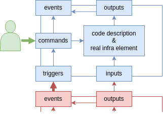

# Brick concept and dependencies

This docs will help you to understand how to represent a brick and its 
sub-element, understand how playing with these element will let us manage the 3 dependency types.

To understand the why of this concept you should read this article: [philosophy](
./philosophy.md)

## Define brick concept

### In short words

First, exeIaC deals with infra bricks. What is an infra brick ? Basically it's 
a directory that contains some infra code. It can be a terraform directory to 
deploy a VM, an ansible playbook to configure an host, an helm chart or simply 
a template that describe some instruction to do manually.

### Try to go deeper

To manage our infra, exeIaC only manage brick (it's far more simple than have
too much concept). So an infra have to be seen as one super brick that contains 
bricks, that can contains bricks.

Bricks are layed on other bricks and so depends of brick that have 
been layed previously. Where are thoose dependencies ? We have only one concept 
so those dependency are in bricks too.

In a devops way of thinking we want to have the most comprehensive 
approach of infra. So the infra should contain all elements and process to 
deploy and maintain an application on line. So a brick is not only the 
terraform code it is also the makefile or the documentation to deploy it (and 
not only deploy it but also plan, lint...)

If we write the last 2 ingredients in our brick we should be able to have the 
intelligence to deploy our infra in the right order. But it still miss 
something. An infra lives and sometime you update someting. And as in a wall, 
you can't change a brick in a middle of the wall without update brick on that 
changed brick, in infra it's the same. And we may have something like events 
that triggers a re-deploy.

So a brick contains :
- Code description: the infra code (terraform, ansible...)
- Commands: the brick interface to let us know how to deploy, plan, get the 
  specific state of a brick... 
- Output: the infra specific state as the password generated or the ip address
  assigned during the deploy of the brick
- State: the infra real state : does the infra drifted or have already been 
  deployed
- Input: Some data of its environment (other brick output) taken in input of 
  some command
- Trigger: some trigger to know when it should be re-deploy
- Event: that will trigger other bricks command.

So brick's input and output are static. They describe a state of the infra.
Event and trigger are ephemeral they describe what happens and what should be 
done.

So command can be execute by human after modifying code or can be triggered by 
an event of an other brick.

Command takes in input some output of other bricks and the code description. 

Command also generate as output some events. Those events could be :
- the deploy correct a drift or have nothing to do
- the deploy have changed this output value
- the deploy have recreated this VM instance (because the specs of the VM
  you can find in output haven't change so it's not visible by watching outputs)

## How exeIaC implement it

For exeIaC the brick command is a module. It permit factorization. And basically it's
an executable with a standardized interface that can be enriched.
The module interface should contain a method to specify what is the implemented interface and how to retrieve events for each method.
[How to write module](./howto_write_module.md)

What input is needed for what command method and how to present it is defined 
in a brick.yml file inside the brick directory.
[How to write a brick](./howto_write_brick.md)

## Dependency types

### Examples

To explore all the three dependency types, we will base us on an example. In this example we will focus on the link between 3 brick of an infra.
Here the brick list and their outputs :
- A: a cloud VM instance
  - output:
    - hw_spec.ram
    - hw_spec.cpu
  - event:
    - vm_recreated
- B: configuration of that VM instance
  - input:
    - hw_spec.ram
- C: a hop ssh server that is needed to connect and configure the instance
  - output:
    - ip_address
    - credentials

The list of outputs are not exhaustive in a real case but we only need 
those to explain the three type of dependency.

`schema`

 
### Precise what is a dependency

Ok brick depends of each other and of course we can't create a VM on a network 
that doesn't exist or configure a VM that doesn't exist. But in what way define 
different type of dependencies can be usefull ?

We search to define different type of dependency to know when we have to 
re-deploy a brick. It's not because a brick has changed that you have to 
re-deploy all bricks on top of it. If I install vim on my hop ssh server, I 
don't need to redeploy because it's not a dependency.

So a dependency is a data from brick's output or event. A dependency can be an 
input or a trigger or perhaps both.

But we call that dependency, what brick element depends of a dependency in an 
implementation point of view ? It's the command element (module) that need 
dependencies to execute itself.

All command method needs input ? Maybe but not the same. If you implement a 
lint method to check your code I doubt that it needs any input. Same, maybe
for a terraform apply you need to have a tfvars file, but to make a terraform 
out you only need acces to the state.

So a dependency is a data that you take from an other brick output or event and 
that you need for some specific module method.

And each dependency can trigger or not a specific brick's module method.

### The classic dependency

This is the most common : when the input changes, it triggers a redeploy. 
For example for brick B it could be: A.hw_specs.ram to reconfigure the java 
heapsize.

### The weak dependency

The module need the data as input to excute, but the change of the data won't 
trigger a re-deploy. For example to deploy the brick B you need to get
C.ip_address and C.credentials to connect to VM but actually, if C.credentials 
change it won't impact the brick B configuration.

### The special dependency

This category contains all dependency that trigger a re-deploy but are not an 
input change.
For example, if you want to destroy and recreate with the same input the VM of 
brick A or even you destroy and recreate it without changing any output readed 
as input of brick B. You need to re-deploy the configuration of the VM (brick 
B). Actually the configuration has disapear.
You can do that by testing the boolean A.vm_recreated.

Else, brick A could have as output a vm-id or a creation-timestamp that could be
manage as a classic dependency. But you see here that this dependency value 
isn't needed as input.

We can also imagine that brick A create lot of VM so it's event could be a list 
of recreated VMs. So the trigger would be a test on a data type list.

As you see we can imagine many special dependency. For exeIaC it's only a test 
that is not linked to a change of a value.

### What other thing the system permit

We can trigger other action than a simple deploy (lay). It is usefull if you 
want to implement many different lay function. For example for 1-10-100 deploy 
or for renewing password.

## From elementary brick to infra

### Elementary brick

An elementary brick is a brick that contain infra code. It's the smallest 
element of an infra. What we have define in [Sub-element of a brick](#sub-element-of-a-brick) is actually an elementary brick.

### Higher order brick

An higher order brick only contains some elementary bricks.
To execute an higher-order brick you have to execute in the right order all 
sub-bricks. The input of an higher order brick correspond to the inputs of
all the sub-brick (without input that call output of the higher-order brick).
The output of an higher order brick correspond to all the output of elementary
 bricks it contains.

An higher order brick is not seen very differently as an elementary brick. 
Sometimes exeIaC vision is only based on elementary bricks but lets re-define 
brick's element for an higher order brick
- **input & triggers**: all inputs and triggers of it's sub-brick minus inputs 
  and events that reference other sub-bricks
- **output & events**: all outputs and events of its sub-bricks
- **command**: deploy an higher order brick is deploy all it's sub-brick in the 
  right order. 

**NB: execution order** to rework
As you can see in page [how to write a brick](./howto_write_brick.md) each 
brick has its directory name prefixed by a priority number. So take care 
of your higher-order brick composition. Actually in a higher-order brick you 
will execute all brick with the priority you see. A higher order brick will 
be seen as an elementary brick. So it is simple for a human to read his/her 
infra code. You won't have to understand how to execute a brick to execute it.

### Room

It's an higher order brick that correspond to a directory and that have to be 
listed in the [exeIaC configuration file](./howto_write_configuration_file.md) 
to be seen by exeIaC. It's convention are a bit different than other brick, but
it can be considered as a brick.

Usually it is a git repository.

### Infra

An infra is an ordered list of rooms. So it's also a brick. A self sufficient 
brick with no input, and triggers and with no output and events.

